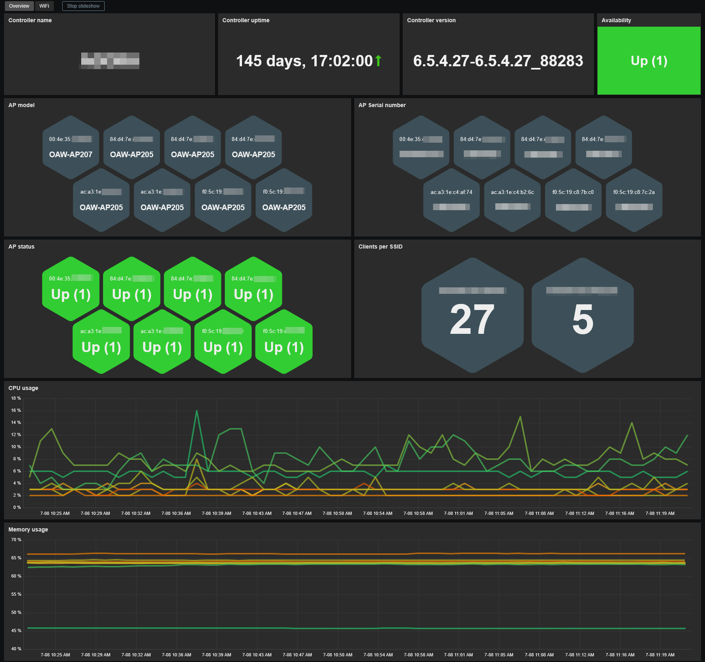
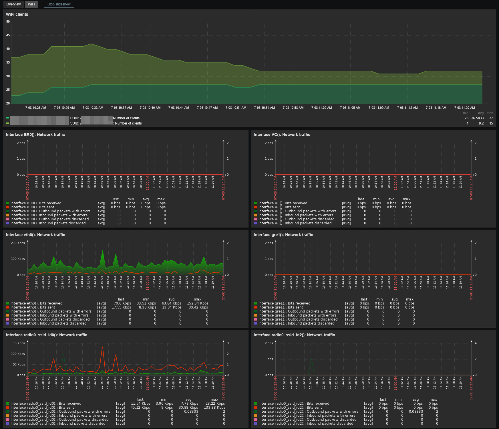

# Template Alcatel & Aruba Instant AP Controller by SNMP
## Source
This template is based on original template written by Christos Diamantis. 
https://github.com/Airler/zbx-community-templates/tree/main/Network_Devices/Aruba/template_aruba_instant_ap_controller/7.0
## Compatibility
This template is designed for monitoring Instant AP controller via SNMP which is used by Alcatel and Aruba. 
It has been tested on the following models:
- Alcatel OAW-AP103
- Alcatel OAW-AP205
- Alcatel OAW-AP207
## Usage
Import template as usual: **Data Collection -> Templates -> Import** 
Add your master AP using SNMPv2 or SNMPv3, then adjust the macro values if needed.
## Dashboards preview
**Overview:**

**WiFi:**

