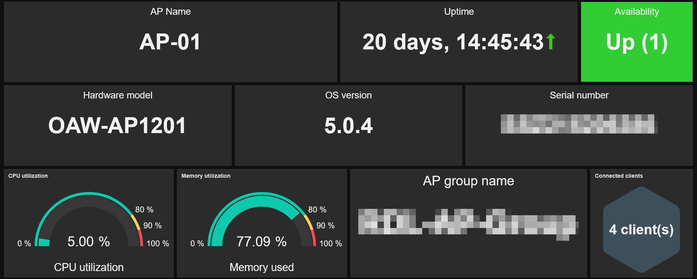
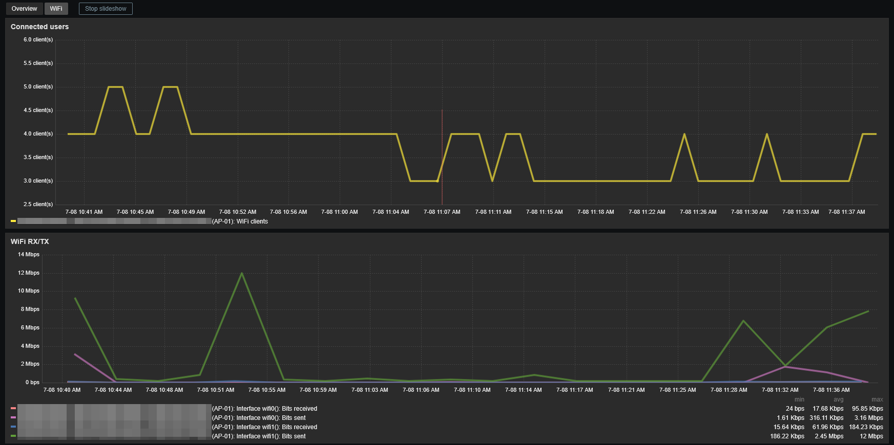

# Template Alcatel-Lucent Enterprise OmniAccess Stellar by SNMP
## Source
Built from scratch by E-MSN.
## Compatibility
This template is designed for monitoring Alcatel OmniAccess Stellar WiFi access points via SNMP. 
It has been tested on the following models:
- OAW 1201
- OAW 1301
## Usage
Import template as usual: **Data Collection -> Templates -> Import** 
Add your master AP using SNMPv2 or SNMPv3, then adjust the macro values if needed.
> **Note:** Even if you use the controller mode, you will need to add each AP in your monitoring! 

## Dashboards preview
**Overview:**

**Network:**

**WiFi:**

