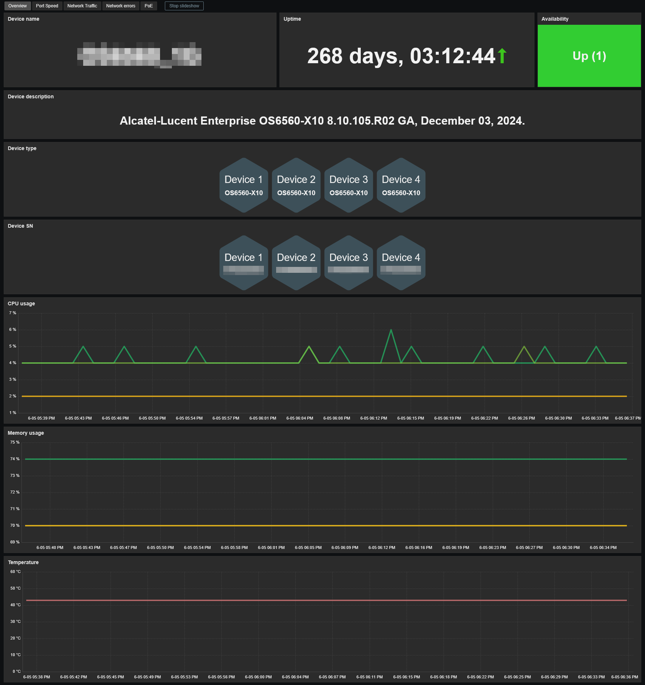
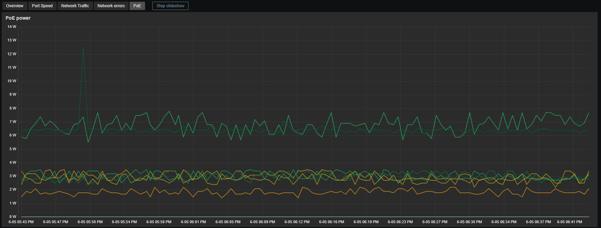

# Template Alcatel-Lucent Enterprise OmniSwitch by SNMP
## Source
This template is based on original templates written by Alexander Bakaldin. 
https://github.com/zabbix/community-templates/tree/main/Network_Devices/Alcatel-Lucent_Enterprise/template_alcatel-lucent_enterprise_omniswitch_aos_release_6.x 
https://github.com/zabbix/community-templates/tree/main/Network_Devices/Alcatel-Lucent_Enterprise/template_alcatel-lucent_enterprise_omniswitch_aos_release_8.x
## Compatibility
This template is designed for monitoring Alcatel-Lucent OmniSwitch via SNMP. 
It's a unified template (1 template for both AOS v6.x and AOS v8.x). 
It has been tested on the following models:
- Alcatel OmniSwitch v6:
  - OS6250 series
  - OS6350 series
  - OS6450 series
- Alcatel OmniSwitch v8:
  - OS2220 series
  - OS2260 series
  - OS6360 series
  - OS6560 series 
  - OS6860 series
## Usage
Import template as usual: **Data Collection -> Templates -> Import** 
Add your switch using **SNMPv2** or **SNMPv3**, then adjust the macro values if needed.
## Dashboards preview
**Overview:**

**Port Speed:**

**Network Traffic:**

**Network errors:**

**PoE (when applicable):**

