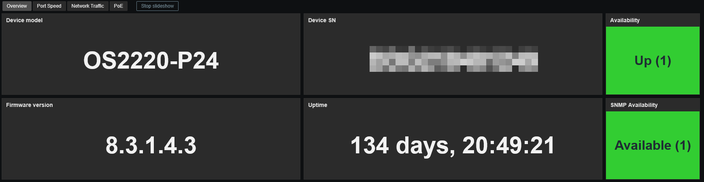
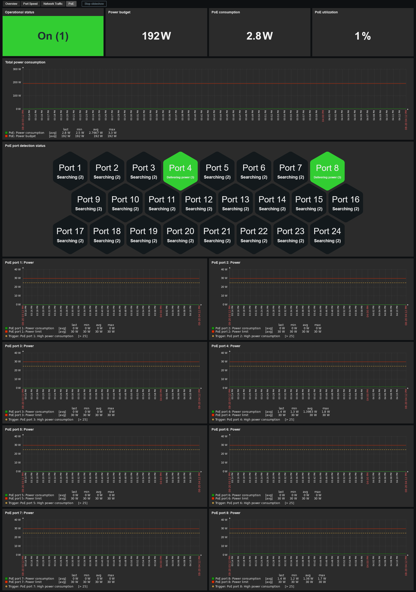

# Template Alcatel-Lucent Entreprise WebSmart switch by SNMP
## Source
Built from scratch by E-MSN.

## Compatibility
This template is designed for monitoring Alcatel-Lucent WebSmart switch via SNMP. 
It has been tested on the following models:
- OS2220 series (firmware v8.3.1.4.3)
- OS2260 series (firmware v5.2.102.R04 GA)

## Usage
Import template as usual: **Data Collection -> Templates -> Import** 
Add your switch using **SNMPv2** or **SNMPv3**, then adjust the macro values if needed.

## Dashboards preview
**Overview:**

**Port Speed:**

**Network Traffic:**

**PoE (when applicable):**

