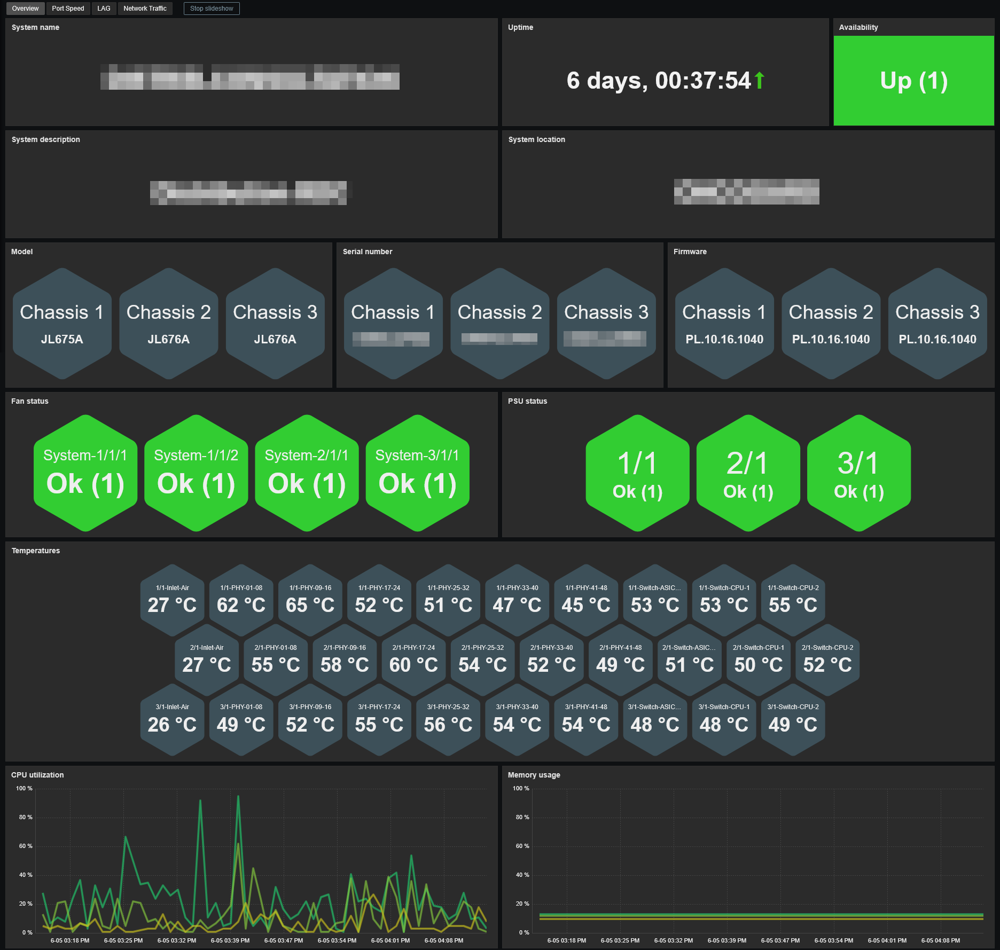
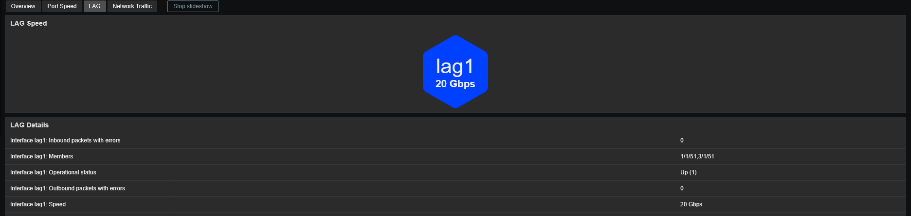
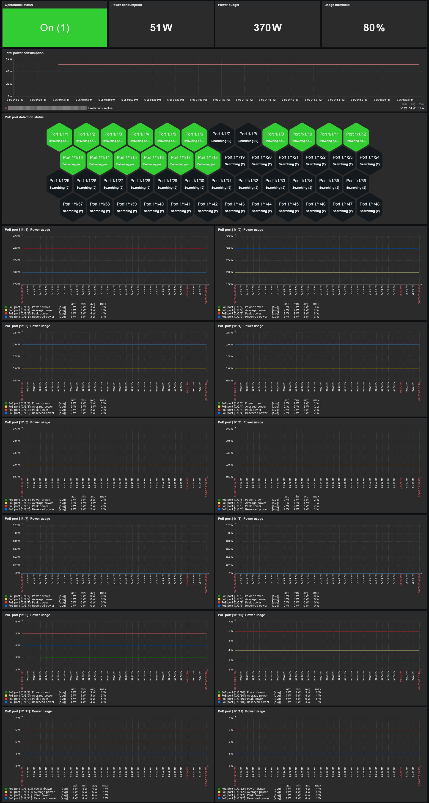
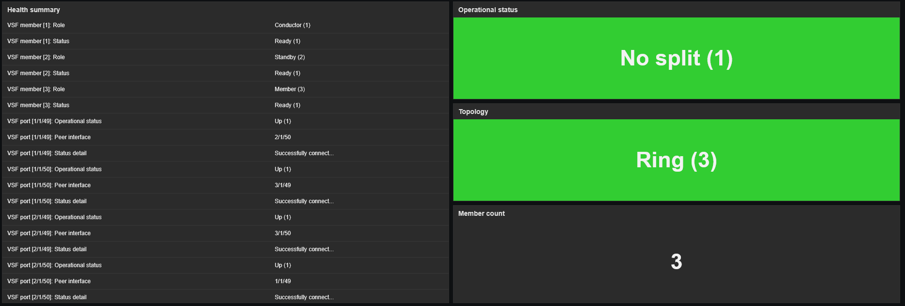
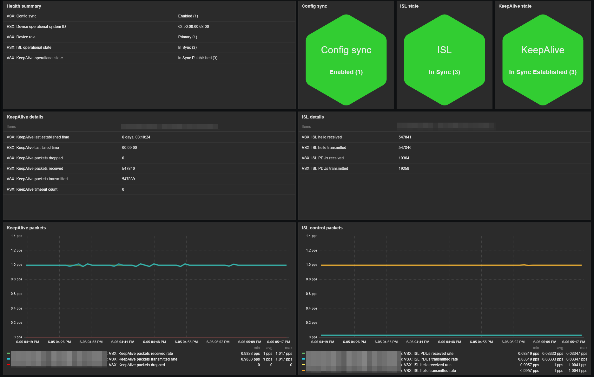

# Template Aruba CX 6000 series by SNMP
## Source
This template is based on the built-in Zabbix template *Aruba CX 8300s by SNMP*. 
## Compatibility
This template is designed for monitoring Aruba CX 6000 series via SNMP. 
It has been tested with firmware versions PL.10.14.x through PL.10.16.x and validated on the following models:
- CX 6100 (JL675A and JL676A)
- CX 6300M (JL658A)
## Usage
Import template as usual: **Data Collection -> Templates -> Import** 
Add your switch using **SNMPv2** or **SNMPv3**, then adjust the macro values if needed. 
> **Note:** If you are using VSF, you must set the `{$ARUBA.VSF.MEMBERS.MIN}` macro to the expected number of VSF members for the trigger to work correctly.
## Dashboards preview
**Overview:**

**Port Speed:**

**LAG (when applicable):**

**Network Traffic:**

**PoE (when applicable):**

**VSF (when applicable):**

**VSX (when applicable):**

