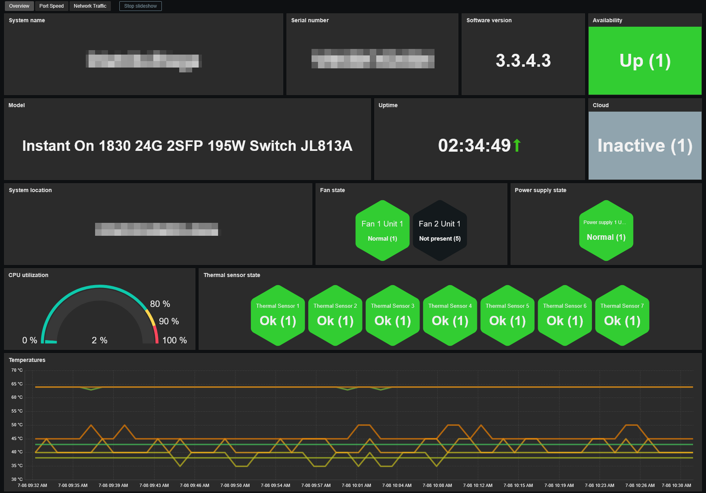
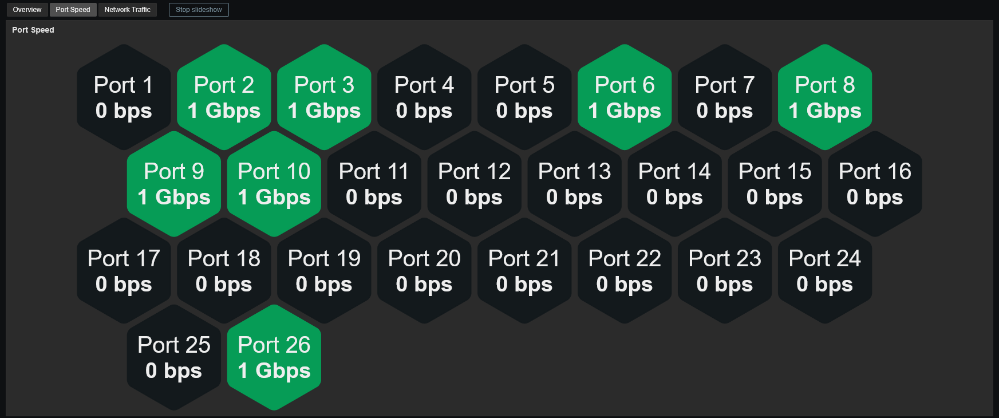
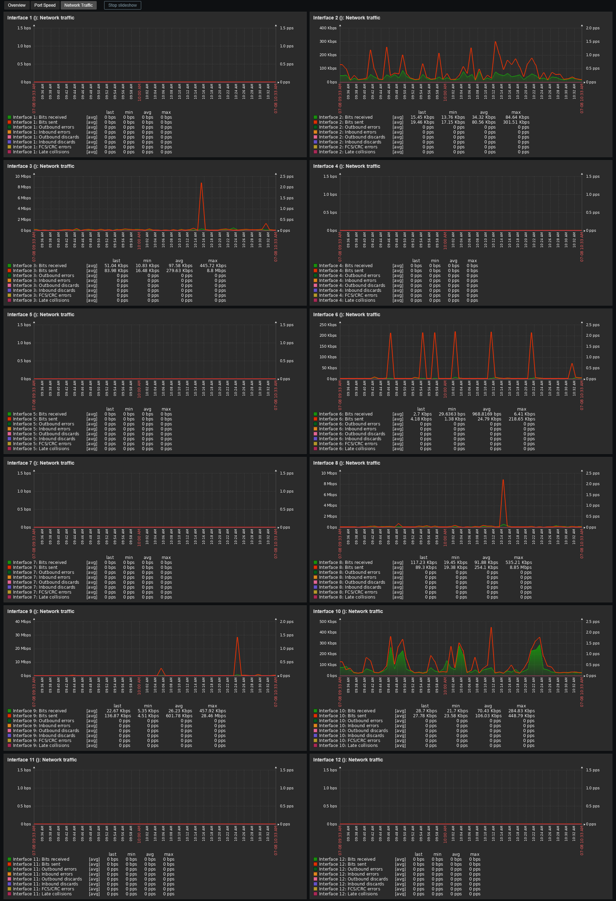
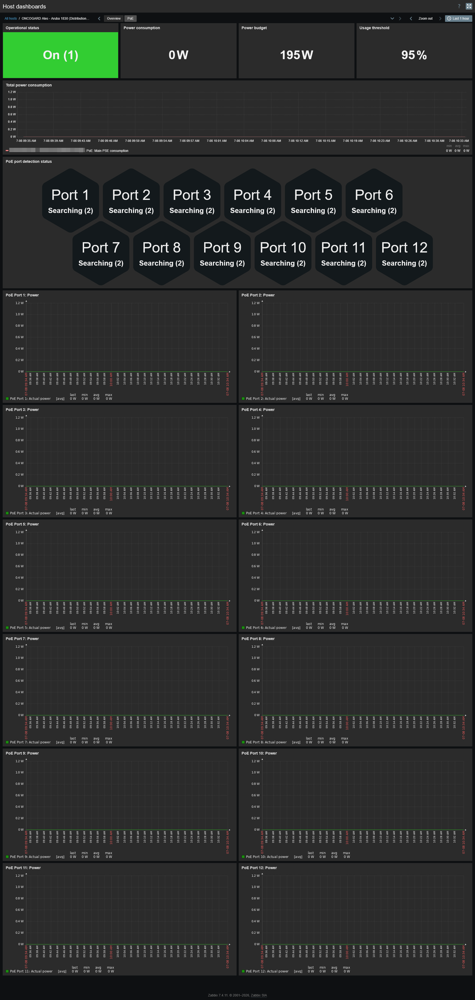

# Template Aruba Instant On 1830 Series by SNMP
## Source
Built from scratch by E-MSN.
## Compatibility
This template is designed for monitoring Aruba Instant On 1830 switches via SNMP. 
It has been tested on the following models:
- JL812A
- JL813A
## Usage
Import template as usual: **Data Collection -> Templates -> Import** 
Add your switch using SNMPv2, then adjust the macro values if needed.
## Dashboards preview
**Overview:**

**Port Speed:**

**Network Traffic:**

**PoE (when applicable):**

