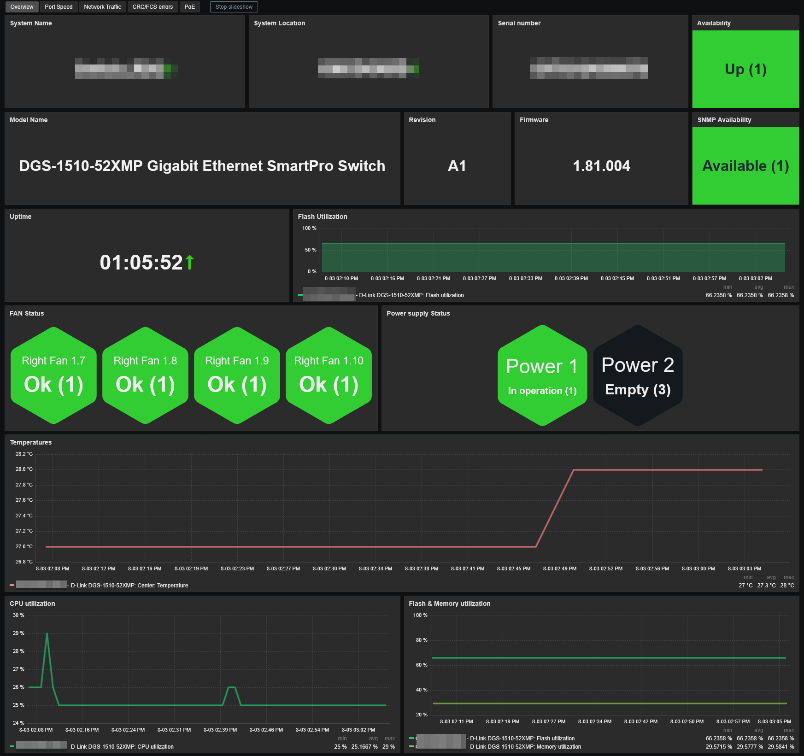
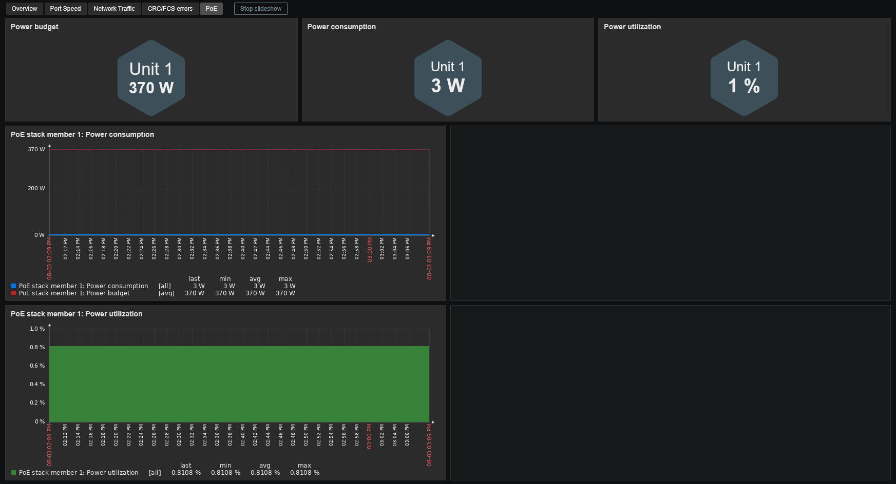

# Template D-Link DGS_DXS Switch by SNMP
## Source
This template is based on the built-in Zabbix template *D-Link DES_DGS Switch by SNMP*. 

## Compatibility
This template is designed for monitoring D-Link DGS and DXS switches via SNMP. 
It has been tested on the following models:
- D-Link DGS-1510-52X (rev A2)
- D-Link DGS-1510-52XMP (rev A1)
- D-Link DXS-1210-28S (rev A1)

## Usage
Import template as usual: **Data Collection -> Templates -> Import** 
Add your switch using SNMPv2 or SNMPv3, then adjust the macro values if needed.

## Dashboards preview
**Overview:**

**Port Speed:**

**Network Traffic:**

**CRC/FCS Errors:**

**PoE (when applicable):**

