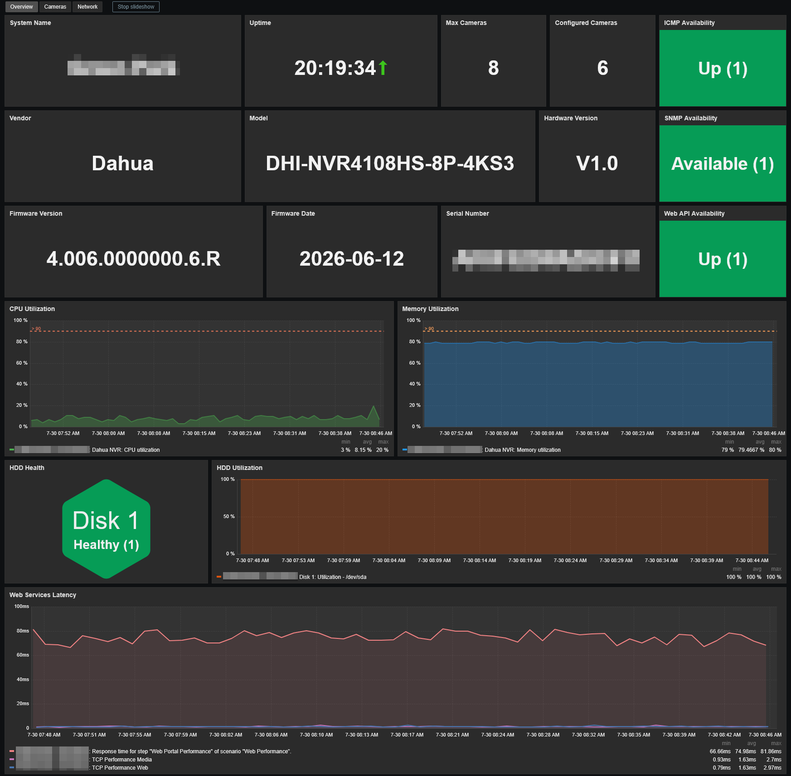
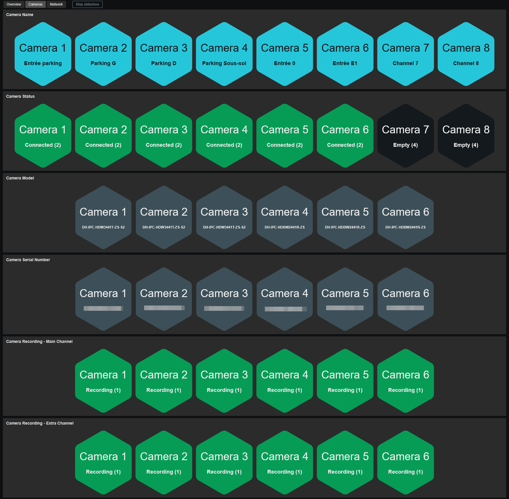
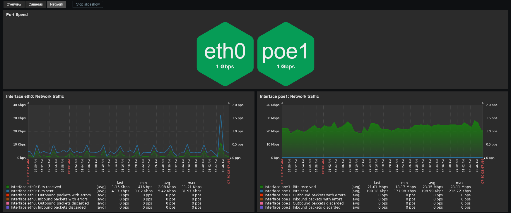

# Template Dahua NVR by web API and SNMP
## Source
Built from scratch by E-MSN with inspiration of the template written by Diasdm for the SNMP part. 
https://github.com/diasdmhub/Intelbras_NVR_Zabbix_Template

## Compatibility
This hybrid template is designed for monitoring Dahua NVRs through both the CGI web API and SNMP. 
The CGI web API is used to retrieve detailed information about cameras, recording, storage, and events, while SNMP is used for system resources and network interfaces. 
It has been tested on the following NVR models:
- Dahua DHI-NVR4108HS-8P-4KS3

It has also been tested with the following cameras:
- Dahua DH-IPC-HDBW2441R-ZS
- Dahua DH-IPC-HDW3441T-ZS-S2

## Usage
Import template as usual: **Data Collection -> Templates -> Import** 
Add your NVR and configure at least the required values:
- Set the host interface type to **SNMP** (IP or DNS)
- **{$DAHUA.API.USER}** : Username to access the API
- **{$DAHUA.API.PASSWORD}** : Password to access the API
> **Note:** This template uses 64-bit counters to monitor network traffic. Although these NVRs support SNMPv1, its use is not recommended because SNMPv1 does not support these counters.

## Dashboards preview
**Overview:**

**Cameras:**

**Network:**

