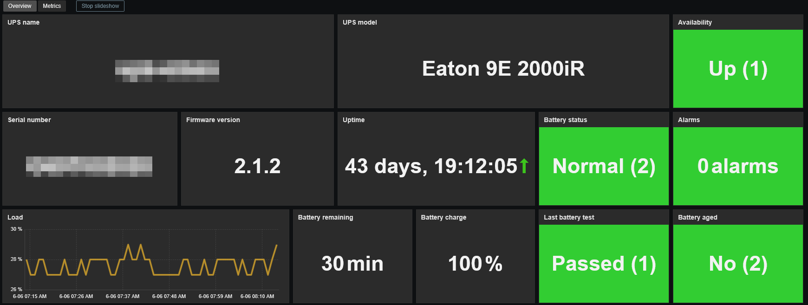
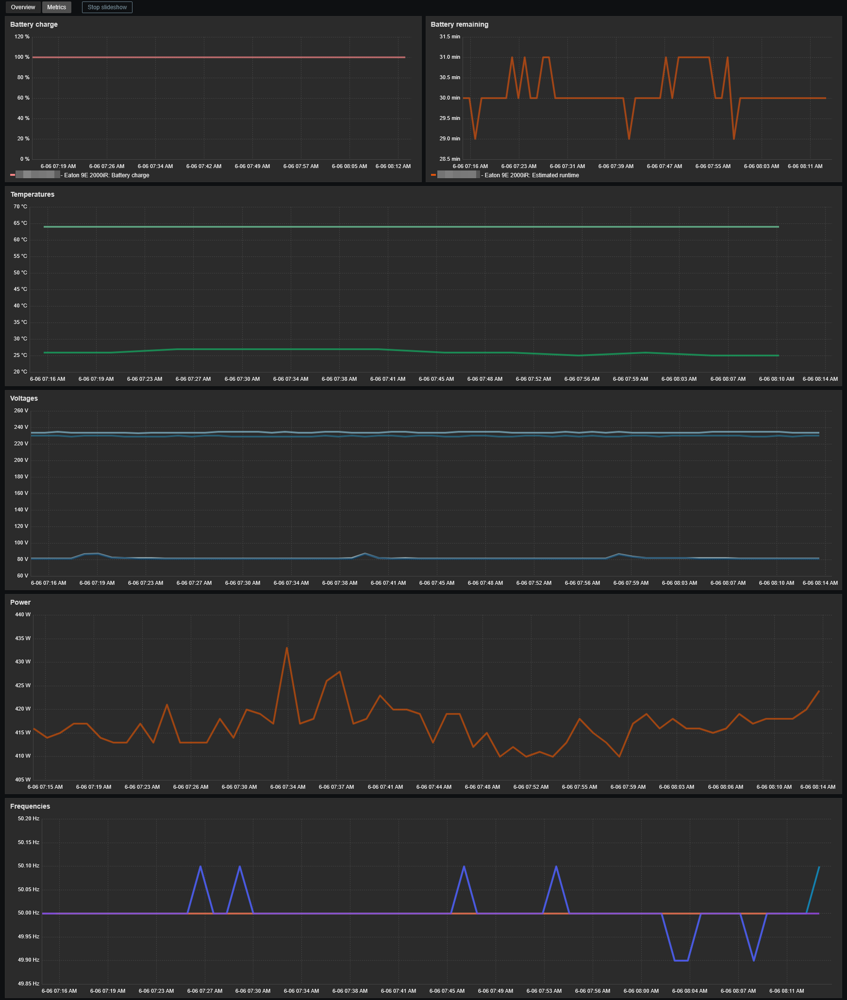

# Template Eaton UPS by SNMP
## Source
Built from scratch by E-MSN.
## Compatibility
This template is designed for monitoring Eaton UPS via SNMP. 
It has been tested on the following network card models:
- Network-MS (legacy)
- Network M2
- Network M3
## Usage
Import template as usual: **Data Collection -> Templates -> Import** 
You will get 2 templates:
- Eaton UPS - Network M2 & M3 by SNMP
- Eaton UPS - Network MS Legacy by SNMP

Add your UPS using **SNMPv1**, **SNMPv2** or **SNMPv3**, then adjust the macro values if needed. 

## Dashboards preview
**Overview:**

**Metrics:**

