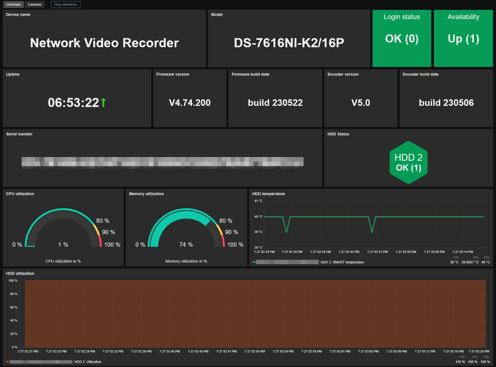
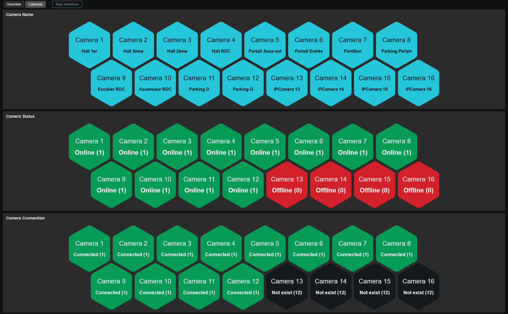

# Template Hikvision NVR by web API
## Source
This template is based on the built-in Zabbix template *Hikvision camera by HTTP*. 

## Compatibility
This template is designed for monitoring Hikvision NVR via ISAPI web API. 
It has been tested on the following models:
- Hikvision DS-7616NI-K2/16P

## Usage
Import template as usual: **Data Collection -> Templates -> Import** 
Add your NVR and configure at least the required values:
- Set the host interface type to **Agent** (IP or DNS) for ICMP ping checks
- **{$HIKVISION_ISAPI.HOST}** : IP address of your NVR
- **{$HIKVISION_ISAPI.SCHEME}** : http or https ("http" by default)
- **{$HIKVISION_ISAPI.PORT}** : ISAPI listening port ("80" by default)
- **{$HIKVISION_ISAPI.USER}** : Username to access ISAPI API ("admin" by default)
- **{$HIKVISION_ISAPI.PASSWORD}}** : Password to access ISAPI API

> **Note:** The trigger **Hikvision: HDD {#HDD_ID} utilization is high** is disabled by default because NVR commonly use cyclic recording. 
> When overwrite mode is enabled, the HDD is expected to remain nearly full. 
> Enable this trigger only for configurations where free disk space is expected to remain available
## Dashboards preview
**Overview:**

**Cameras:**

