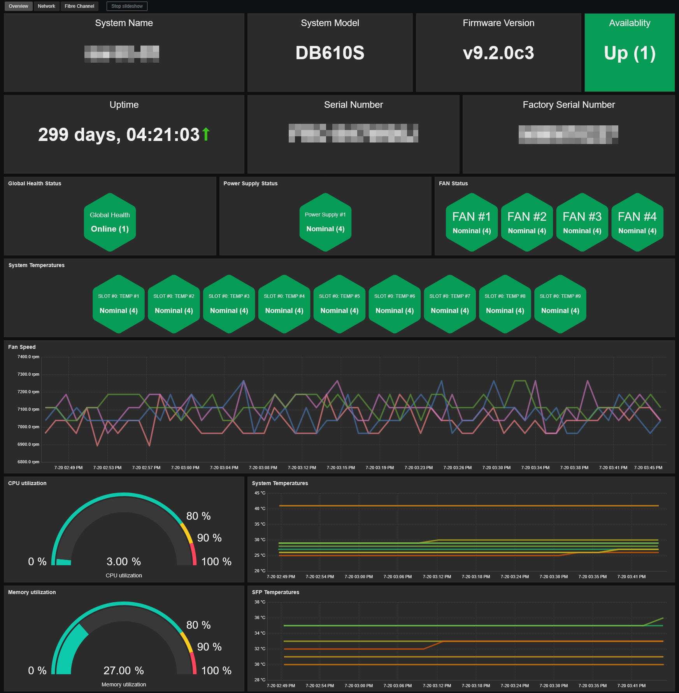
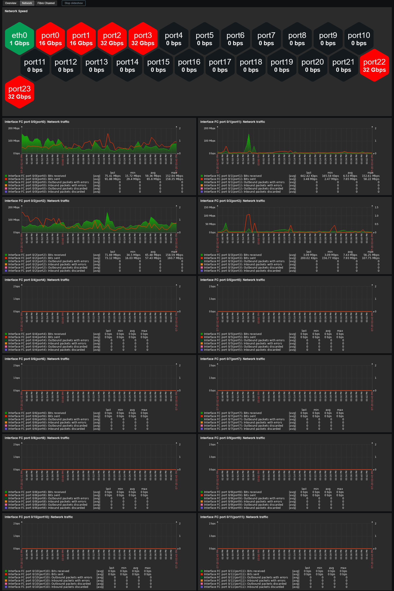

# Template Lenovo ThinkSystem DB610S FC SAN Switch by SNMP
## Source
This template is based on the built-in Zabbix template *Brocade FC by SNMP*. 

## Compatibility
This template is designed for monitoring Lenovo ThinkSystem DB610S Fibre Channel SAN switches (based on Brocade Fabric OS) via SNMP. 
It has been tested on the following models:
- Lenovo ThinkSystem DB610S

## Usage
Import template as usual: **Data Collection -> Templates -> Import** 
Add your FC switch using SNMPv3, then adjust the macro values if needed.
> **Note:** This template uses 64-bit counters to monitor network traffic. Although these switches support SNMPv1, its use is not recommended because SNMPv1 does not support these counters.
## Dashboards preview
**Overview:**

**Network:**

**Fibre Channel:**

