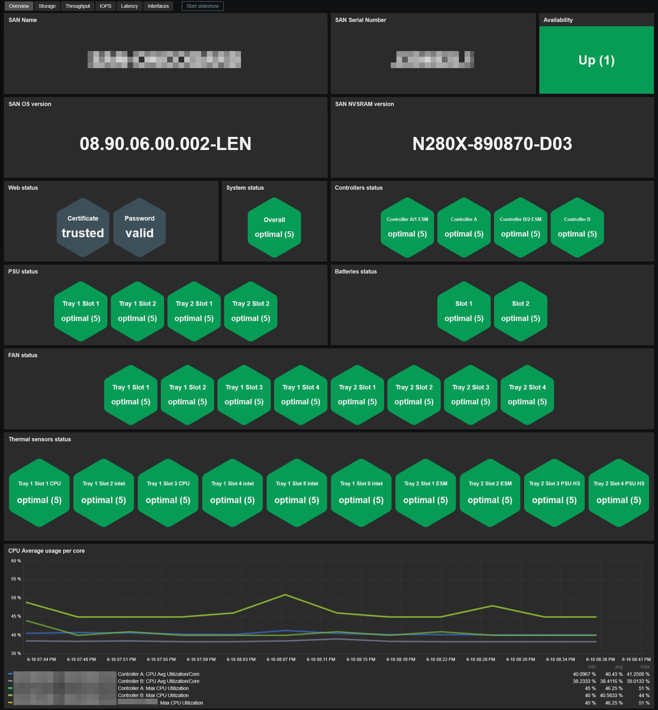
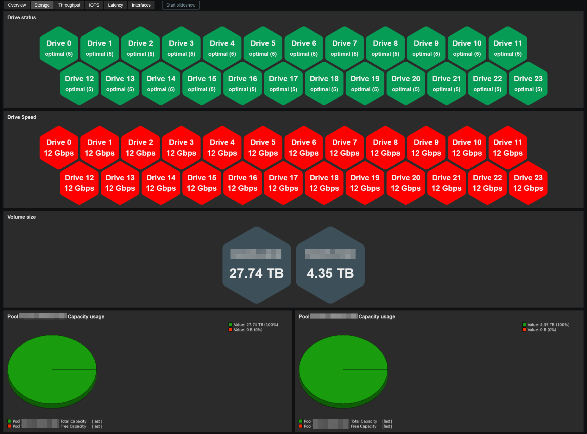
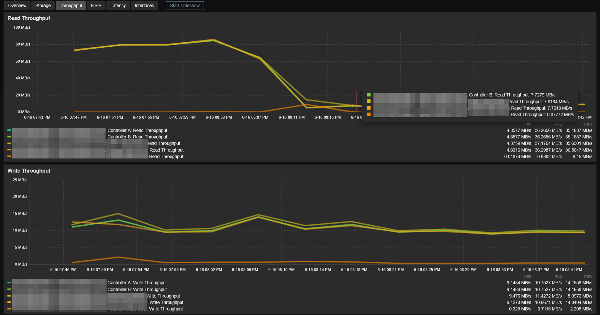
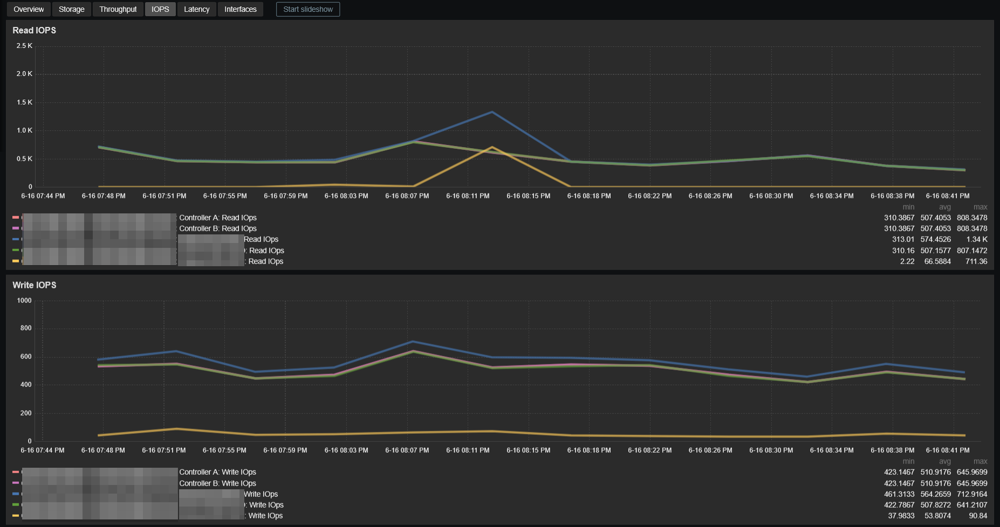
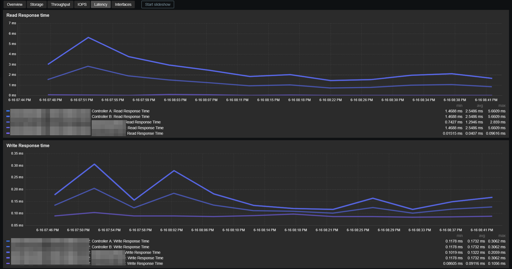
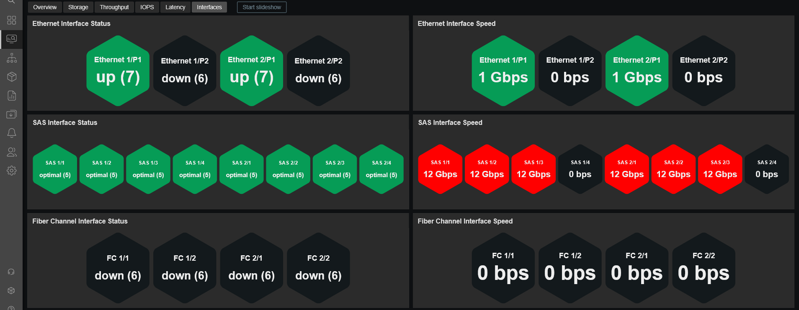

# Template Lenovo ThinkSystem DE Series by web API (SANtricity)
## Source
This template was built from scratch by E-MSN, with inspiration from templates written by A. Cherednikov and Yaroslav Sharaev. 
Forum : https://www.zabbix.com/forum/zabbix-help/457970-template-for-lenovo-thinksystem-de6000f-or-netapp-santricity-web-services#post460129 
Github : https://github.com/NicKerrr/zabbix-templates
## Compatibility
This template is designed for monitoring Lenovo ThinkSystem DE Series storage arrays through the SANtricity Web Services API. 
It has been tested on the following models:
- Lenovo ThinkSystem DE4000H (Type 7Y75)

It has also been tested with the following expansion shelf:
- Lenovo ThinkSystem DE240S (Type 7Y68)
## Usage
Import template as usual: **Data Collection -> Templates -> Import** 
Add your SAN and configure at least the required values:
- Set the host interface type to **Agent** (IP or DNS) for ICMP ping checks
- **{$SANTRICITY.IP}** : IP address (usually "P1" ethernet port on the controller of your choice)
- **{$SANTRICITY.USERNAME}** : Username to access the API (read only account recommended - "monitor" by default)
- **{$SANTRICITY.PASSWORD}** : Password to access the API

Adjust other macros values if needed.
## Dashboards preview
**Overview:**

**Storage:**

**Throughput:**

**IOPS:**

**Latency:**

**Interfaces:**

