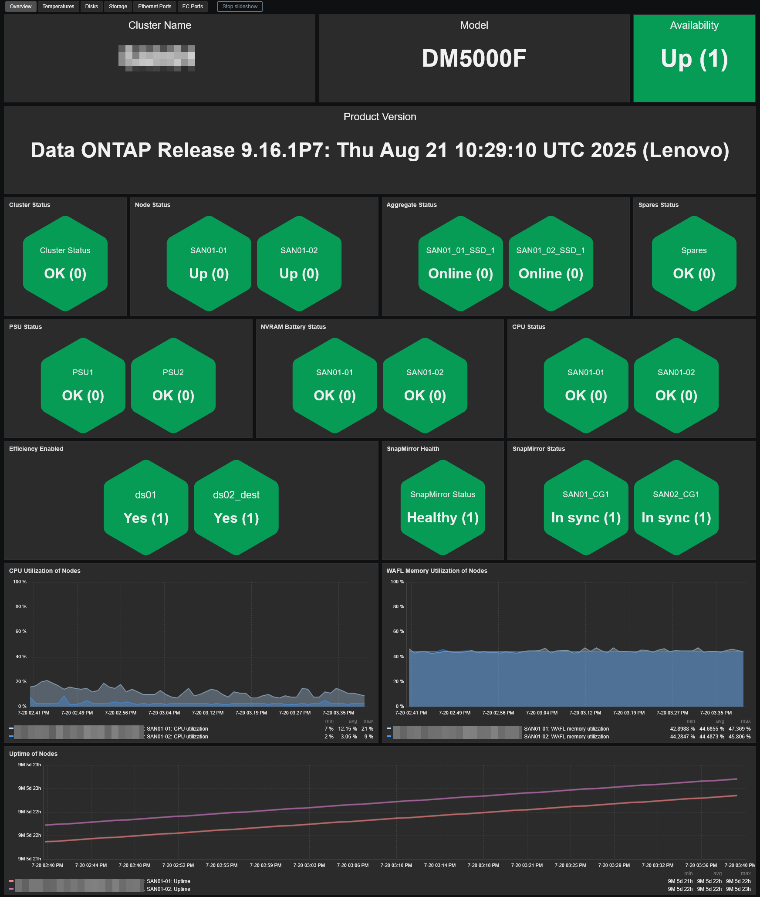
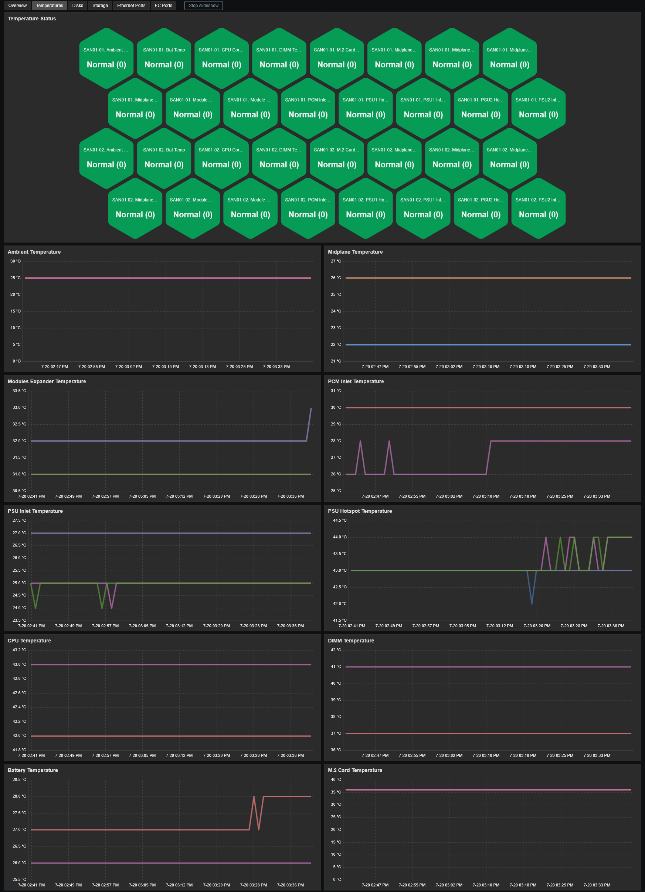
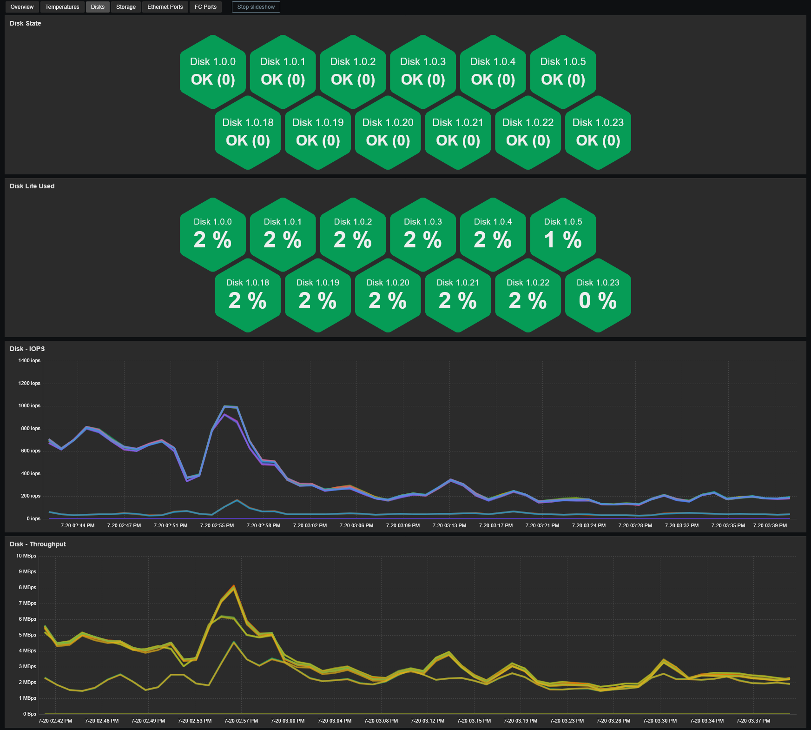
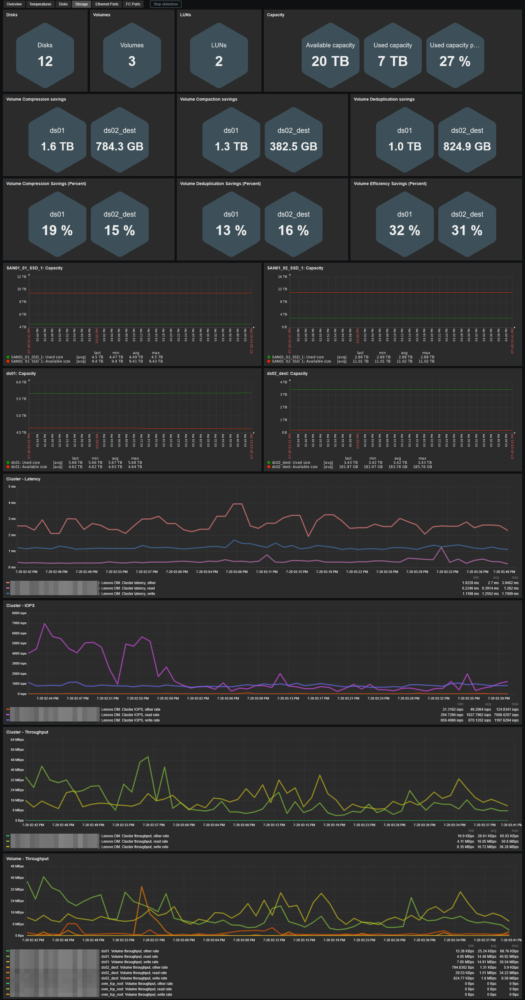

# Template Lenovo ThinkSystem DM Series by Web API (NetApp)
## Source
This template is based on the built-in Zabbix template *NetApp AFF A700 by HTTP*. 

## Compatibility
This template is designed for monitoring Lenovo ThinkSystem DM Series storage arrays through the NetApp ONTAP Web Services API. 
It has been tested on the following models:
- Lenovo ThinkSystem DM5000F (Type 7D7W)

## Usage
Import template as usual: **Data Collection -> Templates -> Import** 
Add your SAN and configure at least the required values:
- Set the host interface type to **Agent** (IP or DNS) for ICMP ping checks (usually "e0M" ethernet port on the controller of your choice)
- **{$ONTAP.USERNAME}** : Username to access the API (read only account recommended)
- **{$ONTAP.USERNAME}** : Password to access the API

## Dashboards preview
**Overview:**

**Temperatures:**

**Disks:**

**Storage:**

**Ethernet Ports:**

**FC Ports:**

