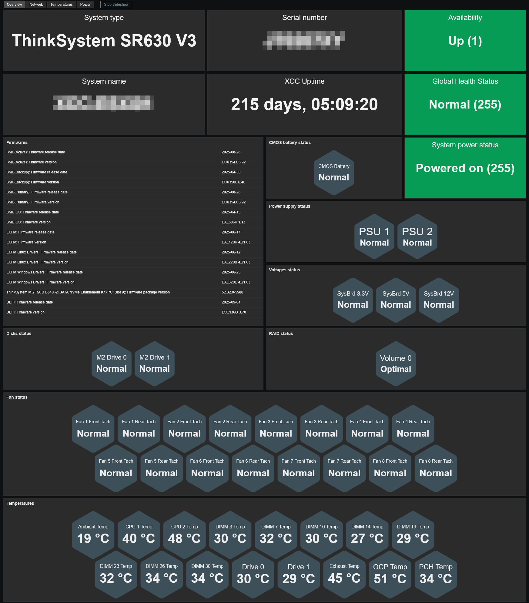
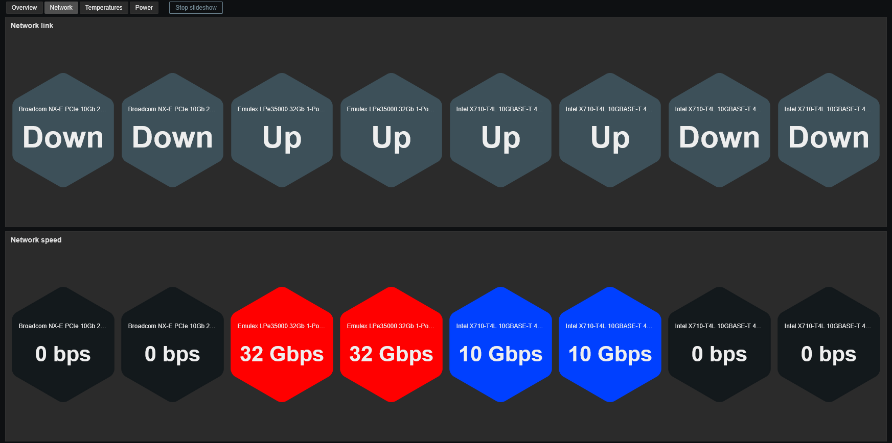
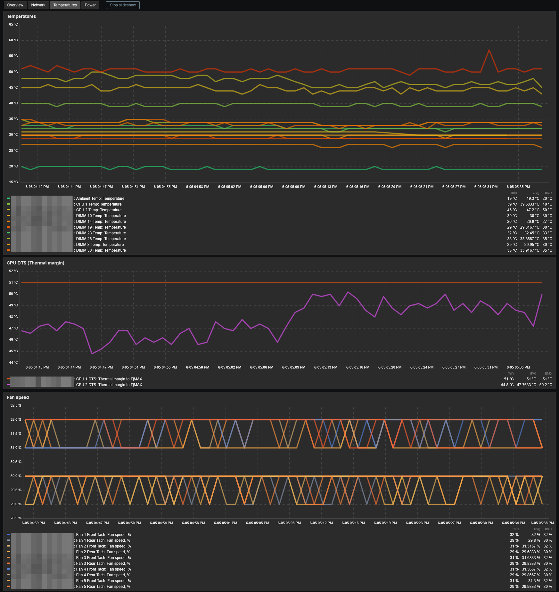
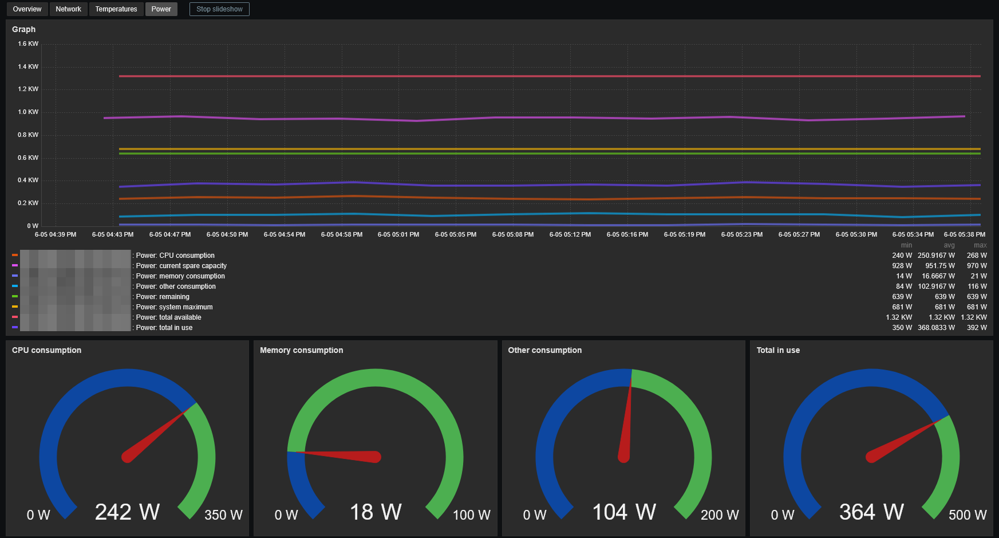

# Template Lenovo XCC by SNMP
## Source
Built from scratch by E-MSN.
## Compatibility
This template is designed for monitoring Lenovo XClarity Controller (XCC) via SNMP. 
It has been validated on the following models:
- SR250v2
- SR530
- SR630
- SR630v2
- SR630v3
## Usage
Import template as usual: **Data Collection -> Templates -> Import** 
Add your XCC using **SNMPv3**, then adjust the macro values if needed.
## Dashboards preview
**Overview:**

**Network:**

**Temperatures:**

**Power:**

