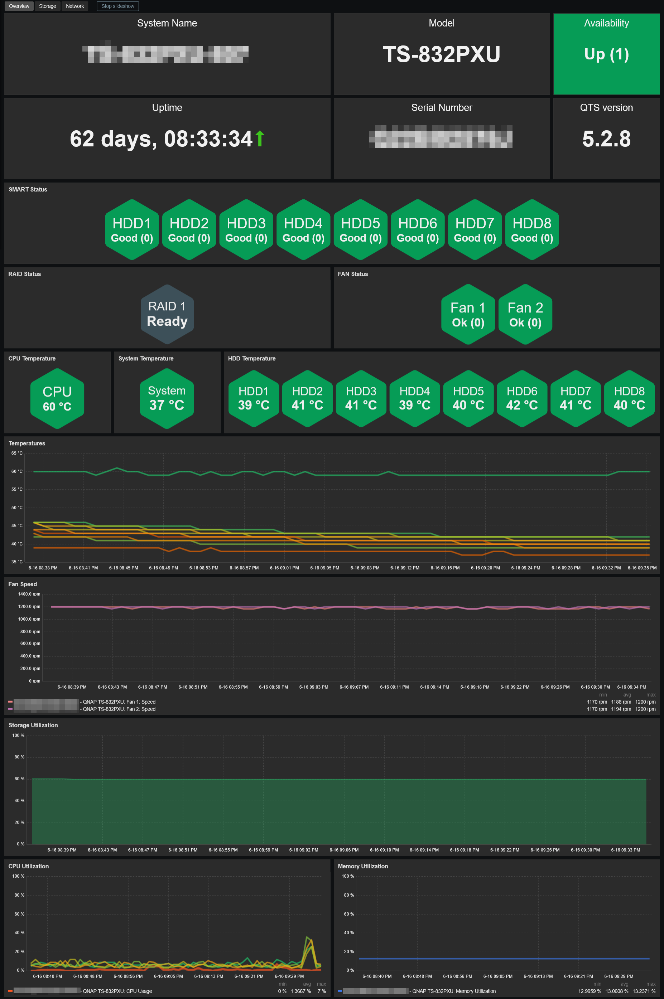
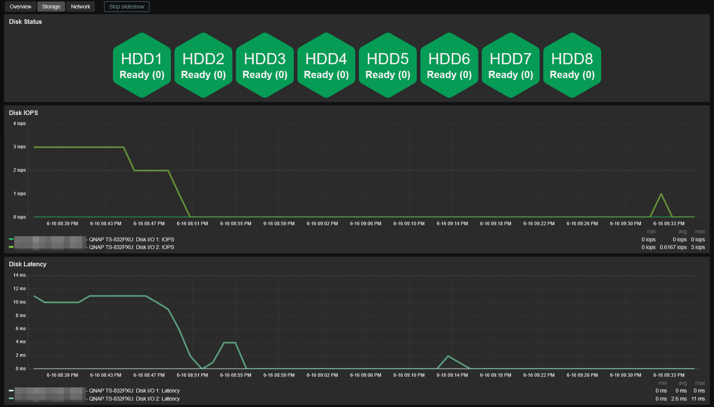
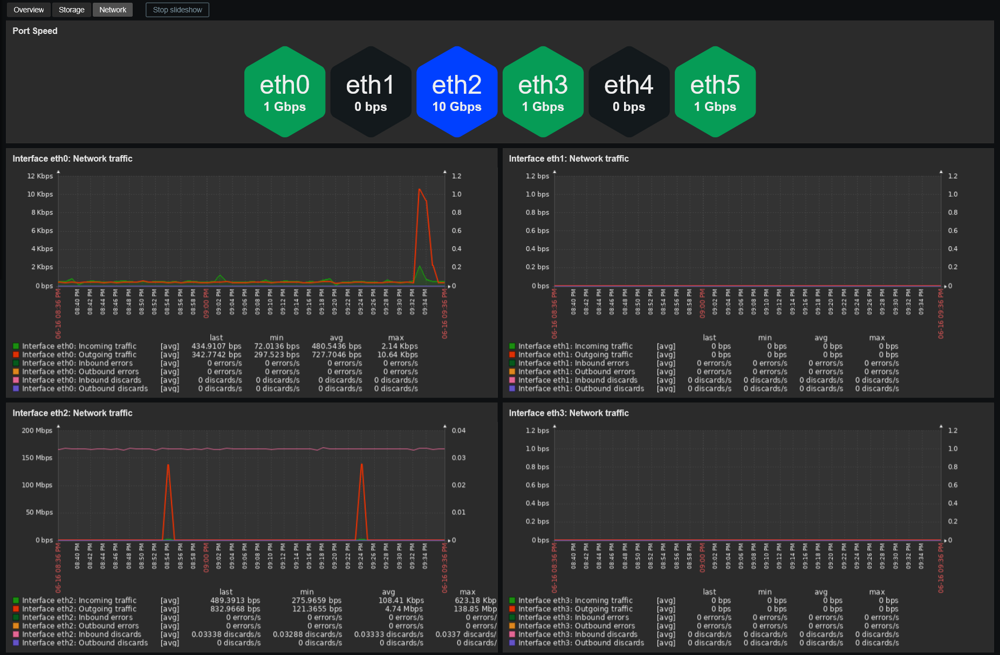

# Template QNAP QTS by SNMP
## Source
Built from scratch by E-MSN.
## Compatibility
This template is designed for monitoring QNAP QTS via SNMP. 
It has been tested with QTS versions 4.3 through 5.2 and validated on the following models:
- TS-231K & TS-231P
- TS-251 & TS-251+
- TS-453A
- TS-453Be, TS-453D, TS-453E & TS-453Pro
- TS-469L
- TS-832PXU
- TS-870
- TS871U-RP
- TVS-471
- TVS-871U-RP

## Usage
Import template as usual: **Data Collection -> Templates -> Import** 
Add your NAS using SNMPv2 or SNMPv3, then adjust the macro values if needed.

> [!WARNING]
> Due to the way QNAP handles SNMP requests, the following settings are recommended:
> - Max repetition count: 5
> - Use combined requests: disabled
>
> If these settings are not applied, SNMP timeouts may occur.

## Dashboards preview
**Overview:**

**Storage:**

**Network:**

