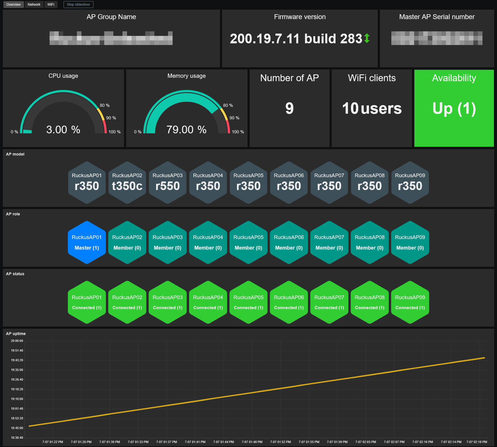
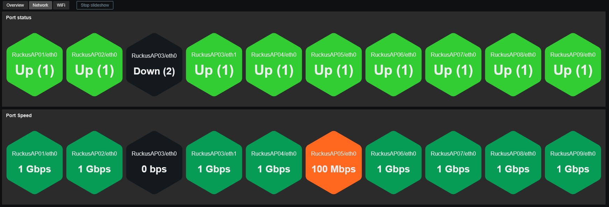
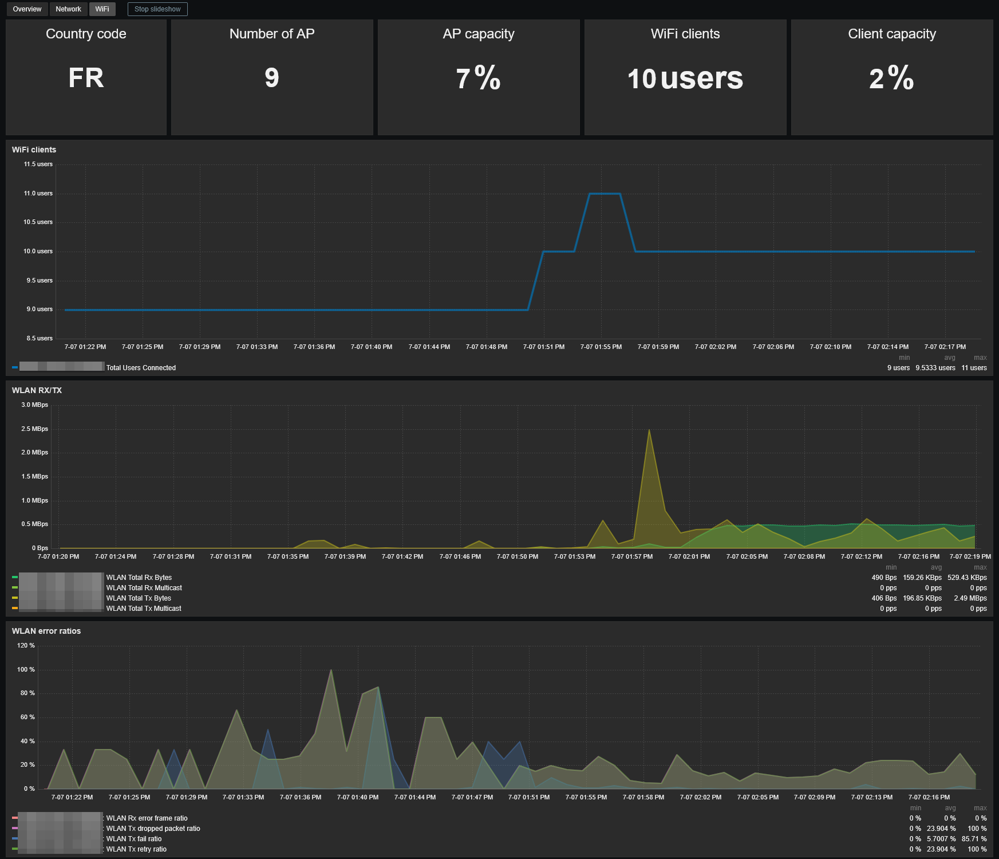

# Template Ruckus Unleashed by SNMP
## Source
This template is based on original template written by @astraliens. 
https://github.com/astraliens/zabbix-template-ruckus-unleashed
## Compatibility
This template is designed for monitoring Ruckus Unleashed WiFi access points via SNMP. 
It has been tested on the following models:
- R350
- R550
- T350C

It works with both standalone APs and Unleashed controller/master mode.
## Usage
Import template as usual: **Data Collection -> Templates -> Import** 
Add your master AP using SNMPv2 or SNMPv3, then adjust the macro values if needed.
> **Note:** Ruckus Unleashed does not use a virtual IP address for the WiFi controller. 
> It is therefore recommended to use a preferred master AP. 
> Otherwise, if the master AP changes, monitoring will be lost.

> **Note:** The AP description is used as AP name (because Ruckus doesn't expose AP name in SNMP). 
> If the description is not set in your AP, the template will use MAC address as AP name.

## Dashboards preview
**Overview:**

**Network:**

**WiFi:**

