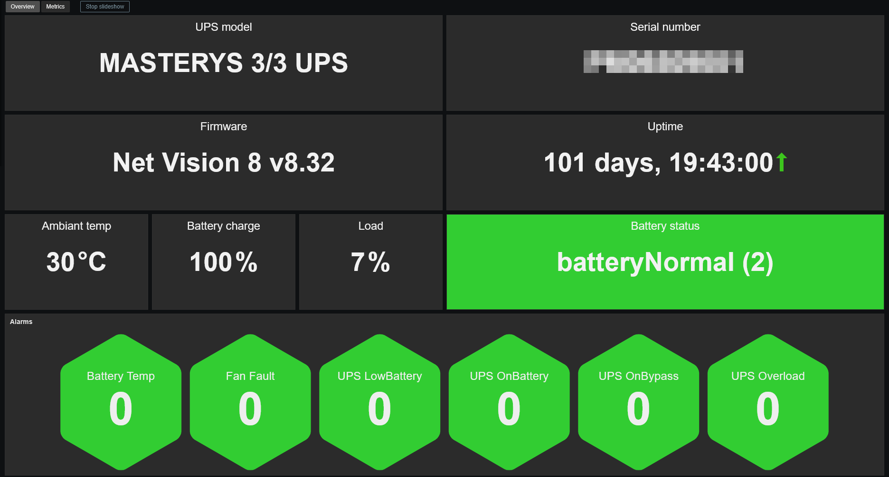
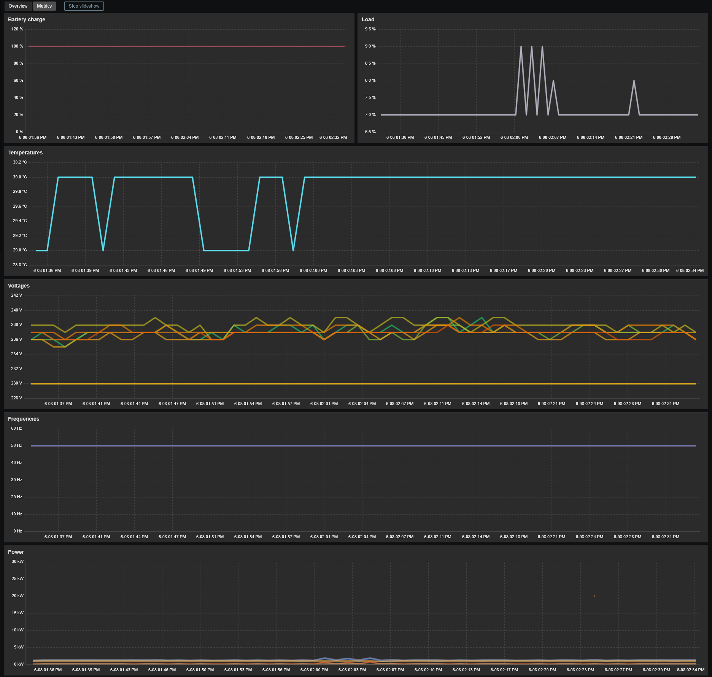

# Template SOCOMEC UPS NetVision by SNMP
## Source
Built from scratch by E-MSN.
## Compatibility
This template is designed for monitoring SOCOMEC UPS via SNMP. 
It has been tested on the following network card models:
- Netvision v7
- Netvision v8
## Usage
Import template as usual: **Data Collection -> Templates -> Import** 
Add your UPS using **SNMPv1**, **SNMPv2** or **SNMPv3**, then adjust the macro values if needed. 

## Dashboards preview
**Overview:**

**Metrics:**

