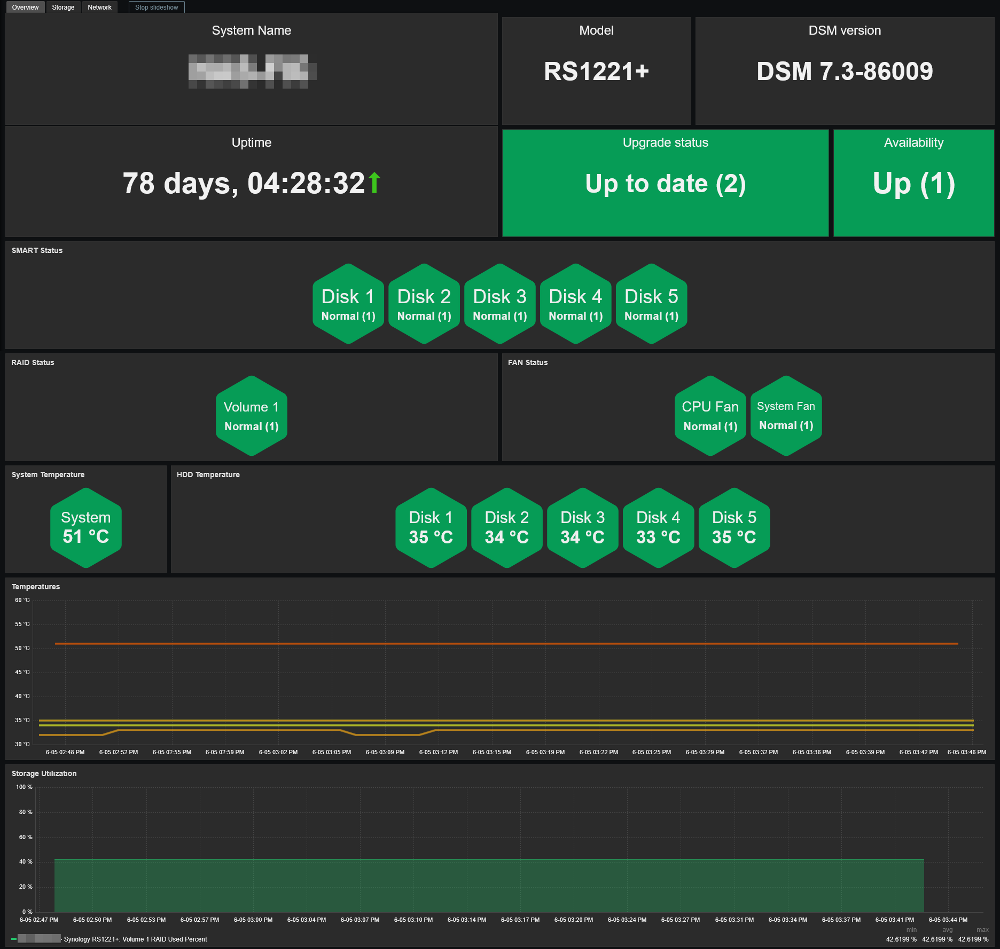
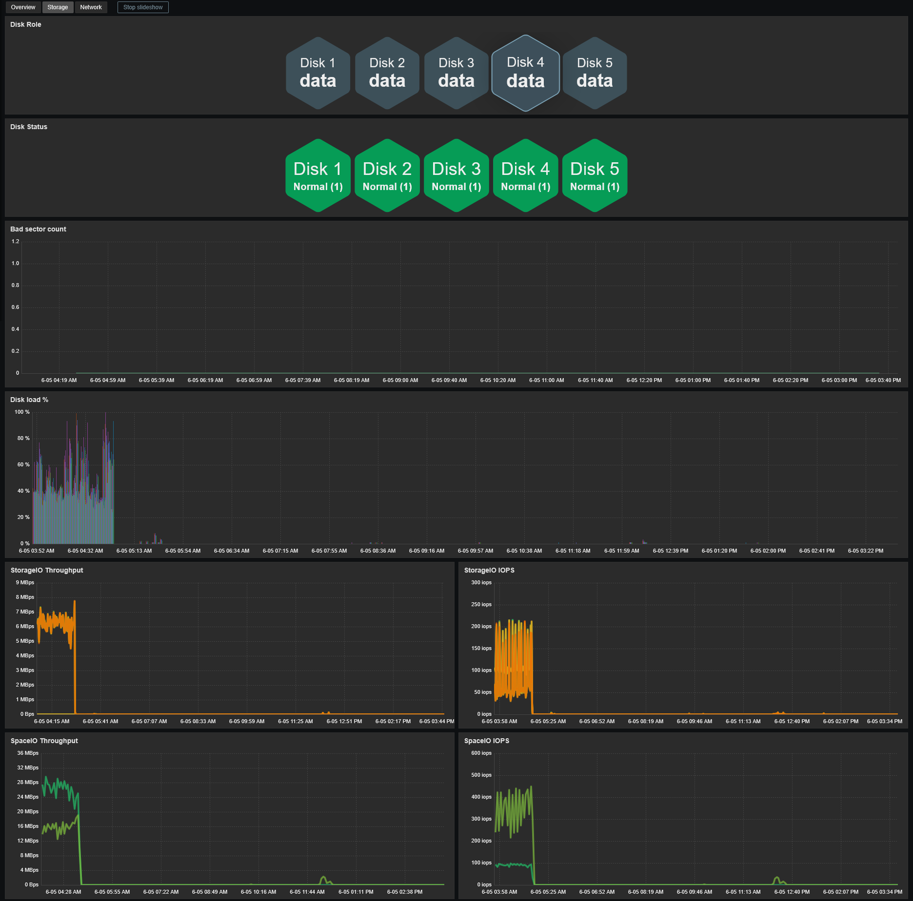
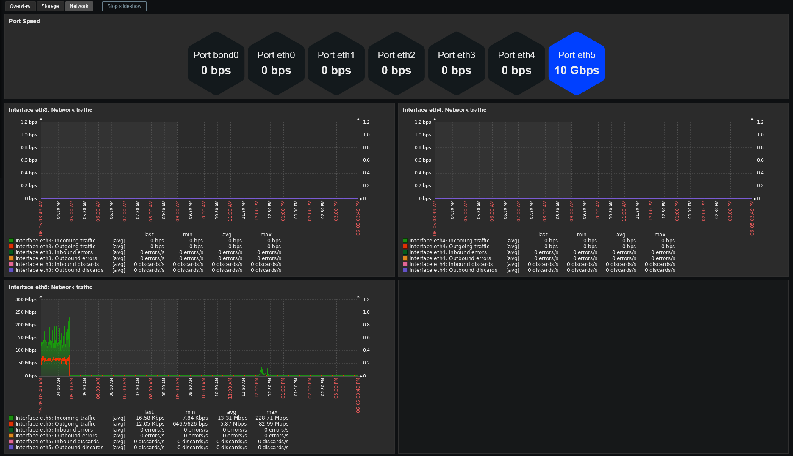

# Template Synology DiskStation by SNMP
## Source
This template is based on the original template written by Helmut Leonhardt. 
https://github.com/zabbix/community-templates/tree/main/Storage_Devices/Synology/template_synology_diskstation_snmpv3
## Compatibility
This template is designed for monitoring Synology NAS devices via SNMP. 
It has been tested with DSM versions 6.2 through 7.3 and validated on the following models:
- DS218
- DS220j
- DS223
- DS1618+
- DS1819+
- RS1221+
- RS2418+

## Usage
Import template as usual: **Data Collection -> Templates -> Import** 
Add your NAS using **SNMPv2** or **SNMPv3**, then adjust the macro values if needed.

## Dashboards preview
**Overview:**

**Storage:**

**Network:**

